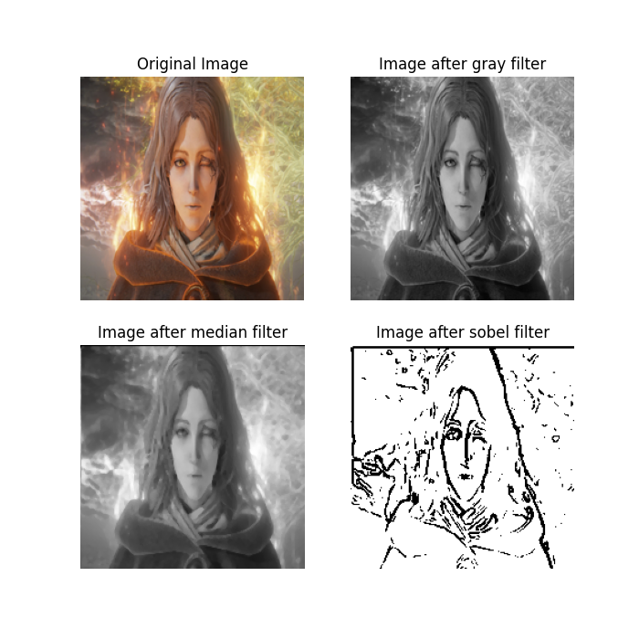

# FPGA-based Image Preprocessing and Ethernet Transmission System

English | [简体中文](./README_SC.md)

> This project is part of the 2024–2025 UESTC "Qiangxin Yumiao" research program and the university-level Innovation & Entrepreneurship Training Plan. It implements an FPGA-based image preprocessing and transmission system: frames from an OV5640 camera are processed through three modules—color-to-grayscale filtering, median filtering (on grayscale), and Sobel edge detection—then transmitted to a PC via Ethernet for subsequent AI edge recognition on the host.

---

## Showcase

<p align="center">
  
  <br/>
  <em>Figure: Example result of the FPGA-side image preprocessing pipeline</em>
  <br/>
  <sup>Image path: results/image_process_results/testbench_results/image_process_example/fpga_method.png</sup>
</p>

## Table of Contents
- [FPGA-based Image Preprocessing and Ethernet Transmission System](#fpga-based-image-preprocessing-and-ethernet-transmission-system)
  - [Showcase](#showcase)
  - [Table of Contents](#table-of-contents)
  - [Use Cases](#use-cases)
  - [Key Advantages](#key-advantages)
  - [Targets and Project Info](#targets-and-project-info)
  - [Quick Start](#quick-start)
  - [Parameters](#parameters)
  - [Performance Evaluation](#performance-evaluation)
  - [Algorithm Choices](#algorithm-choices)
    - [Median vs. Gaussian Filtering](#median-vs-gaussian-filtering)
    - [Sobel vs. Canny](#sobel-vs-canny)
  - [Folders and Project Structure](#folders-and-project-structure)

---

## Use Cases
Edge-side image preprocessing/transmission scenarios, e.g., detecting red-light running by vehicles or e-bikes.

## Key Advantages
- Offload part of the processing traditionally done on the host to the edge device, reducing host compute load.
- Drastically reduce network bandwidth: from raw RGB888 (24-bit) to 1-bit binary images after Sobel.

## Targets and Project Info
- Target Toolchain: Vivado 2023.2
- Target FPGA: Xilinx Artix-7 XC7A100T
- Bitstream: `bitstream/ImageProcess.bit`
- Simulation: `sim/` (includes Verilog TB and Python comparison/driver scripts)
- PC Visualization: `pc_viewer/udp_binary_viewer.py`

## Quick Start
Using the Xiaomeige ACX720-V3 series FPGA board as an example (if you're using a different FPGA, you may need to rewrite the constraints file before programming):

1) Program the bitstream in Vivado
	- Directly program `bitstream/ImageProcess.bit`.

2) Network connection and settings
	- Connect the board and the PC via Ethernet cable.
	- Set the PC NIC IPv4 address to `192.168.0.3`.
	- Enable Jumbo Frames in the NIC properties.

3) Packet capture
	- Use Wireshark to capture and verify the UDP/IPv4 traffic.

4) PC-side visualization
	- Go to `pc_viewer/`, install dependencies per its README, and run `udp_binary_viewer.py`.
	- This will display the filtered binary image in real time on the PC.
	- **You can reset using the S4 button on the FPGA board.**
    - **You can adjust the Sobel edge detection threshold up/down using the S3/S2 buttons on the FPGA board for accurate edge capture.**

Optional (Windows PowerShell example):

```powershell
cd pc_viewer
python -m pip install -r requirements.txt
python .\udp_binary_viewer.py
```

## Parameters
- Frame size: 1280×720
- Frame rate: 30 FPS
- Protocol: UDP / IPv4
- Transmission granularity: line-based; prepend a 2-byte line index to each line
- Image preprocessing: fully pipelined (grayscale → median → Sobel)

## Performance Evaluation
- Bandwidth reduced to 1/24 of the original raw data.
- Compared with an OpenCV-based software implementation, the hardware version reduces per-frame latency by about 12.74%–28.70%.
  - Basis: Processing a single frame of 200×200 image, latency comparison between Google Colab (free version) and Xilinx Artix-7 XC7A100T FPGA (@100MHz).
- Resource usage on the tested FPGA is under 10% for LUT/FF/LUTRAM, enabling low-cost, large-scale edge deployment potential.

> See `results/` for examples and waveforms.

## Algorithm Choices

### Median vs. Gaussian Filtering
Common image noises:
- Gaussian noise: continuous random noise following Gaussian distribution, introducing small random pixel perturbations;
- Salt-and-pepper noise: discrete random white/black dots;
- Uniform noise: reduces image contrast;
- Ripple noise: periodic intensity variations.

Filter characteristics:
- Mean filter: linear; uses neighborhood mean; good for Gaussian/uniform noise but blurs details;
- Gaussian filter: linear; weighted average (Gaussian weights); better on Gaussian noise and preserves details better than mean;
- Median filter: non-linear; uses the median; very effective for salt-and-pepper noise and preserves edges/details.

On FPGA:
- Median requires many comparisons (higher resource usage) but preserves edges best;
- Gaussian uses convolution for weighted average (lower compute) but more edge loss.

Since the system targets edge detection, we use median filtering to smooth noise while preserving edges. Though its suppression on Gaussian noise is not as strong and the resource cost is higher, measurements on Artix-7 show LUT/FF/LUTRAM usage below 10%, which is acceptable.

Salt-and-pepper noise tends to be detected as strong edges by edge detectors, so removing it first is reasonable (even if camera salt-and-pepper noise is typically less than Gaussian noise).

Considering the threshold sensitivity of the Sobel operator, using median filtering helps with stable thresholding across day/night conditions by preserving edge characteristics.

### Sobel vs. Canny
Both are common edge detectors:
- Sobel: lower computation; drawbacks include thicker edges and sensitivity to noise/thresholds;
- Canny: Gaussian filtering + Sobel gradients + non-maximum suppression + double-thresholding + edge tracking; more complete edges, thinner and more accurate, but complex and compute-heavy.

This project only needs relatively simple edge features (e.g., zebra crossings and e-bike contours). Precision requirements are moderate while compute constraints are tight, so we choose Sobel instead of Canny for better real-time performance and resource efficiency.

## Folders and Project Structure
- `bitstream/`: prebuilt `.bit` and flashable `.bin` files.
- `constrs/`: XDC constraints for FPGA IOs.
- `pc_viewer/`: Python visualization script `udp_binary_viewer.py` (thanks to GPT5).
- `results/`: test results and testbench outputs (figures/screenshots).
- `sim/`: all files required by testbenches (Verilog TB, Python comparison/driver scripts, golden data, etc.).
- `sources/`: core IPs and RTL files (e.g., `ImageProcess.v`) and project IP configurations.

```
ImageProcessBasedOnFPGA
├─ bitstream/
├─ constrs/
├─ pc_viewer/
├─ results/
├─ sim/
├─ sources/
└─ ov5640/
```
