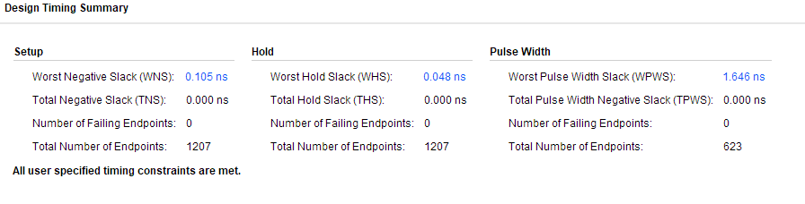
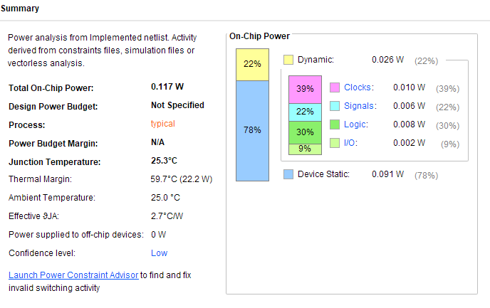
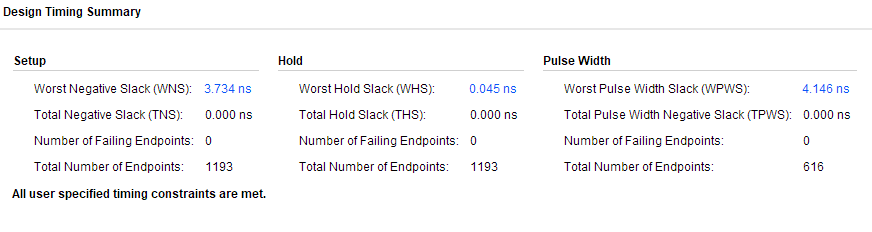

# 图像滤波模块相对于软件端的延时优化情况

## 1. 软件端

采用`time.perf_counter()`方法对Python软件端图像处理代码进行计时

---

### 1.1 Google Colab

免费版

Python版本如下：
```tcl
Python 3.11.13 (main, Jun  4 2025, 08:57:29) [GCC 11.4.0] on linux
```

#### 计入文件读写

在计入文件读写的情况下（即将三大testbench激励产生模块完全顺序执行），代码如下：

```Python
time_init = time.perf_counter()

gray_filter_testbench_stimulus_generator()
median_filter_testbench_stimulus_generator()
sobel_testbench_stimulus_generator()

print(f"The total time consuming in Python Code for Image Process is: {time.perf_counter() - time_init} seconds.")
```

最终计时结果如下：
```
The total time consuming in Python Code for Image Process is: 2.691186765999987 seconds.
```

即在Goole Colab免费版中，共花费约`2.69`s.

---

#### 不计入文件读写

即在脚本内部人为剔除相关文件读写、绘图等操作

具体代码可见Vivado工程文件下的`time_counter_image_process_software_replicate_fpga.py`文件

在Colab免费版中循环100次，取平均值，结果如下：

```
Total circle: 100 | The average time consuming in Python Code for Image Process is: 1.9307445394600018 seconds.
```

即在Goole Colab免费版中，使用Python软件代码，不计入文件读写时间的情况下处理单帧图像平均花费约`1.93`s.

---

### 1.2 My Own Computer

配置为Intel Core i7 12700 + 32GB DDR4 @3200MHz

系统为Windows 11 Pro 23H2

运行IDE为Cursor

Python版本为3.13

同样循环100次取平均值，最终结果如下：

```tcl
Total circle: 100 | The average time consuming in Python Code for Image Process is: 0.736087704999918 seconds.
```

即在高性能个人电脑下，使用Python软件代码，不计入文件读写时间的情况下处理单帧图像平均花费约`0.736`s.

## 2. 硬件端

### 2.1 时钟确定

首先设置时钟约束为`5ns`，如下：

``` tcl
# 定义一个名为sys_clk，周期为5.0ns的时钟，并将其关联到名为clk的顶层端口
create_clock -period 5.0 -name sys_clk [get_ports clk]
```

在Vivado 2023.2 中进行综合、布局、布线，得到时序约束报告如下：



此时，功耗数据如下：



再次设置时钟约束为`10ns`，同理获得时序、功耗数据如下：




功耗降低并不明显，因此再次设置约束为`3ns`，结果失败了，时间裕度为负值

再次设置为`4ns`，仍然不行

再次设置为`4.5ns`，仍然不行

考虑系统稳定性，因此最终便设置时钟周期为`5ns`

---

在`5ns`时钟周期下，图像预处理模块**功耗**为**0.117W**，时间裕度为`0.105ns`

由此前的TESTBENCH仿真可知，该图像处理模块流水线延迟为`8`个时钟周期，处理单帧尺寸为`(200, 200)`的图像需要`40,000`个时钟周期，共需花费`40,008`个时钟周期

因此，在`5ns`系统时钟周期下，硬件图像预处理模块处理单帧尺寸为`(200, 200)`的图像，所花费的时间为：

$$\mathbf{TimeOnHardware}=40008\cdot 5ns\approx 0.2ms$$

即便将时钟周期翻倍为`10ns`以保证更充裕的时钟裕度，其单帧图像处理延时仍然仅为***0.4ms***

---

## 时间优化

从软件端最好的单帧延迟`0.736s`到FPGA硬件端`10ns`时钟周期下的单帧延迟`0.4ms`，其延迟降低了约$99.945652173913\%$

> 若软件端采用流行的滤波算法而非复制FPGA的流水线算法（具体代码可见`time_counter_image_process_software_popular_computation.py`），在Google Colab中同样运行`100`轮，得到平均延迟如下
>
> ```tcl
> --- 软件端图像处理性能测试 ---
> 成功读取图像: test.jpg
> 图像已缩放至 200x200 像素。
> 
> 开始执行处理流程 100 次以测量平均延迟...
> 
> --- 性能测试结果 ---
> 平均单帧处理延迟: 0.6568 毫秒 (ms)
> 等效处理帧率 (FPS): 1522.59
> ```
> 而在我的个人电脑中，`100`轮平均延迟如下：
> ```tcl
> --- 软件端图像处理性能测试 ---
> 成功读取图像: D:/Documents/Vivado/ImageProcess/ImageProcess.srcs/sim_1/new/test.jpg
> 图像已缩放至 200x200 像素。
> 
> 开始执行处理流程 100 次以测量平均延迟...
> 
> --- 性能测试结果 ---
> 平均单帧处理延迟: 0.1899 毫秒 (ms)
> 等效处理帧率 (FPS): 5265.29
> ```
> 因此，这样来看，软件端流行算法的延迟为`0.6568ms`，且并不稳定
> 
> 对比FPGA硬件端`5ns`时钟周期下的单帧延迟`0.2ms`，其延迟降低了约$69.54933\%$
>
> 对比FPGA硬件端`10ns`时钟周期下的单帧延迟`0.4ms`，其延迟降低了约$39.09866\%$
>
> （*Colab上平均延迟为0.39ms左右，与5ns时钟周期比提升约$50\%$*）
>
> *事实上，后续可以对FPGA图像滤波算法进行进一步的并行优化，以更好地降低延迟*